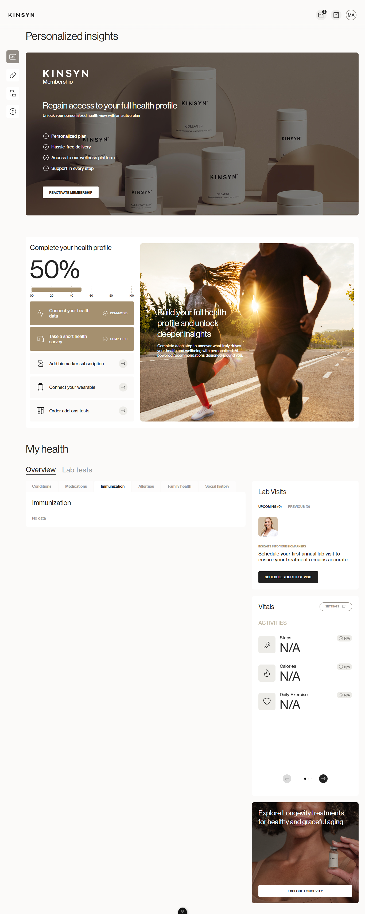
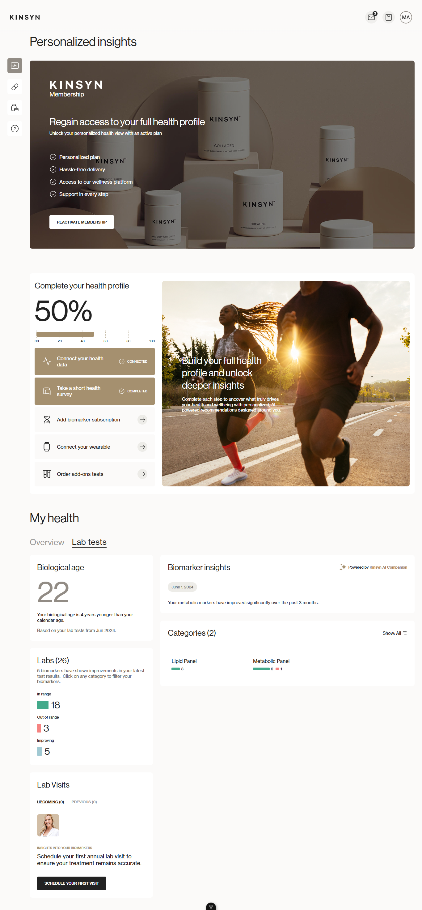

# 🏥 Kinsyn Patient Portal

A modern, responsive **Patient Portal** frontend built with **Vue 3 + Vite**, featuring a fully Dockerized development workflow and component-driven UI development with Storybook.




---

## ✨ Features

- 🖥️ Modern UI built with Vue 3 Composition API
- ⚡ Fast development with Vite build tool
- 🐳 Dockerized development environment for consistency
- 📖 Storybook integration for component-driven development
- 🔍 TypeScript support with type checking
- 🧹 ESLint & Prettier for clean, formatted code
- 🧪 Unit testing support
- 🔗 Full local development with mock backend support

---

## 🛠️ Tech Stack

| Layer                 | Technology                  |
| --------------------- | --------------------------- |
| Frontend Framework    | Vue 3                       |
| Build Tool            | Vite                        |
| Containerization      | Docker & Docker Compose     |
| Component Development | Storybook                   |
| Language              | JavaScript / TypeScript     |
| Code Quality          | ESLint, Prettier            |
| Mock Backend          | Node.js (zero dependencies) |

---

## 🚀 Getting Started

### Prerequisites

- Node.js v22+ (or Docker Desktop for containerized setup)
- Git

---

### ⚙️ Environment Setup

1. Clone the repository:

```sh
git clone https://github.com/syedali067/kinsyn-patient-portal-main.git
cd kinsyn-patient-portal-main
```

2. Create `.env` from the example file:

```sh
cp .env.example .env   # Mac/Linux
copy .env.example .env  # Windows
```

3. Set these values in your `.env`:

```env
VITE_API_SYMFONY_BASE_URL=http://localhost:8000
VITE_API_CRAFT_BASE_URL=http://localhost:8000
```

| Variable                    | Default | Description              |
| --------------------------- | ------- | ------------------------ |
| `APP_PORT`                  | `5173`  | Frontend dev server port |
| `STORYBOOK_PORT`            | `6006`  | Storybook server port    |
| `VITE_API_SYMFONY_BASE_URL` | —       | Symfony backend URL      |
| `VITE_API_CRAFT_BASE_URL`   | —       | Craft CMS backend URL    |

---

## 🔧 Local Development with Mock Backend

Since the real backend (Symfony + Craft CMS) runs on private company servers, a **zero-dependency Node.js mock backend** is included to simulate all API endpoints locally — giving you a fully functional portal experience.

### Step 1 — Start the Mock Backend

Create a folder called `kinsyn-mock-backend`, place `server.js` inside it, then run:

```sh
node server.js
```

You should see:

```
✅  Kinsyn Mock Backend running at http://localhost:8000
    Zero dependencies — pure Node.js
    All endpoints active with full mock data.
```

### Step 2 — Start the Frontend

In a second terminal:

```sh
npm install
npm run dev
```

### Step 3 — Open the App

Visit: **http://localhost:5173/portal**

Login with **any email and password** — the mock backend accepts all credentials.

### ✅ What Works Locally

| Feature                                   | Status |
| ----------------------------------------- | ------ |
| Login / Auth                              | ✅     |
| Dashboard                                 | ✅     |
| Treatments (Weight Management, Longevity) | ✅     |
| Messages / Chat with Providers            | ✅     |
| Pharmacy & Products                       | ✅     |
| Order History & Shipments                 | ✅     |
| Health Insights & Biomarkers              | ✅     |
| Profile & Account Settings                | ✅     |
| Payment Methods                           | ✅     |

---

### 🐳 Start with Docker (Alternative)

**First run** (build images and start all services):

```sh
docker compose up -d --build
```

**Next runs:**

```sh
docker compose up -d
```

**Services available at:**

- App: `http://localhost:5173`
- Storybook: `http://localhost:6006`

**Stop services:**

```sh
docker compose down
```

---

### 💻 Start with Node/NVM

Install and use the correct Node version:

```sh
nvm i      # installs version set in .nvmrc
nvm use    # sets node environment
```

Start development server:

```sh
npm run dev
```

---

## 📜 Useful Commands

```sh
npm run dev          # Start development server
npm run build        # Build for production
npm run lint         # Run ESLint
npm run type-check   # TypeScript type checking
npm run format       # Format code with Prettier
npm run test:unit    # Run unit tests
```

> **Note:** If using Docker, prefix commands with:
> `docker compose run --rm app <command>`

---

## 👨‍💻 Developer

**Muhammad Ali Shah**

- 🐙 GitHub: [@syedali067](https://github.com/syedali067)
- 💼 LinkedIn: [muhammad-ali-mern067](https://linkedin.com/in/muhammad-ali-mern067)
- 📧 Email: as7073085@gmail.com

---

## 📄 License

This project is open source and available under the [MIT License](LICENSE).
